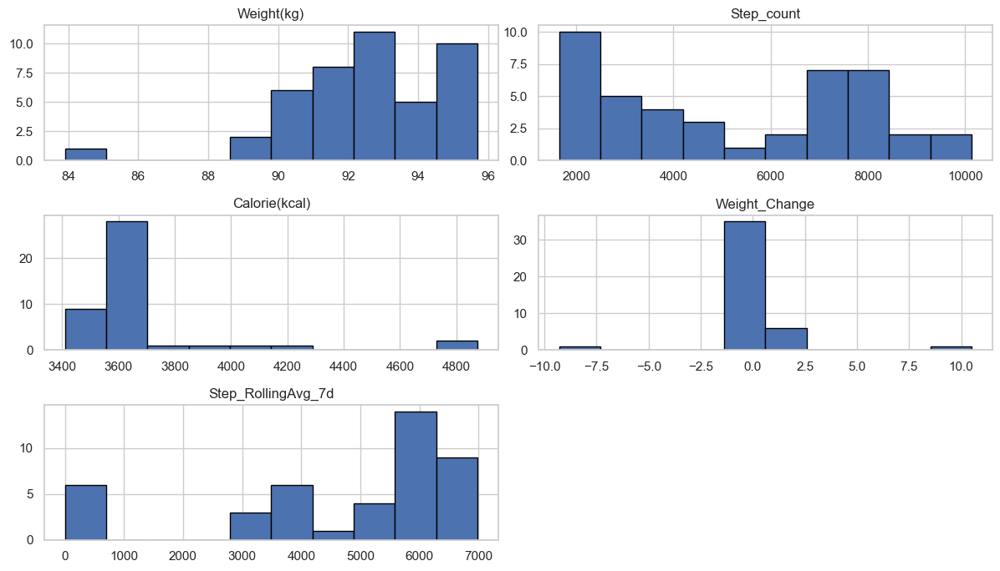
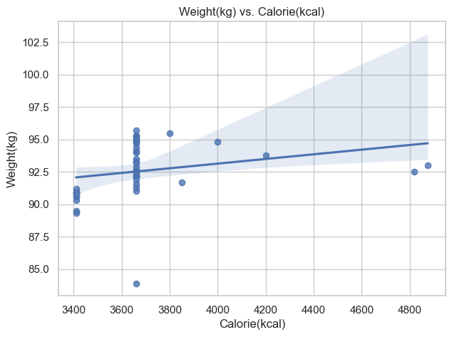
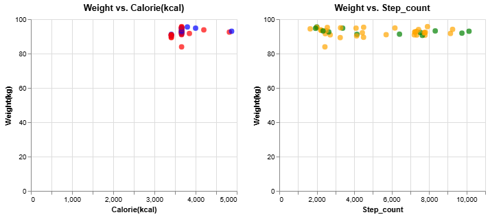
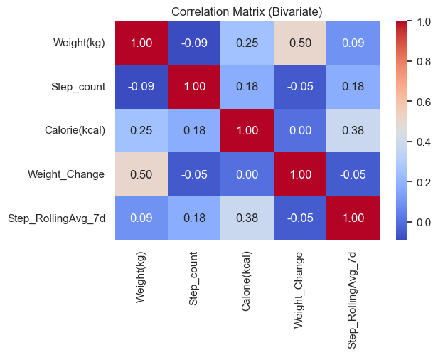
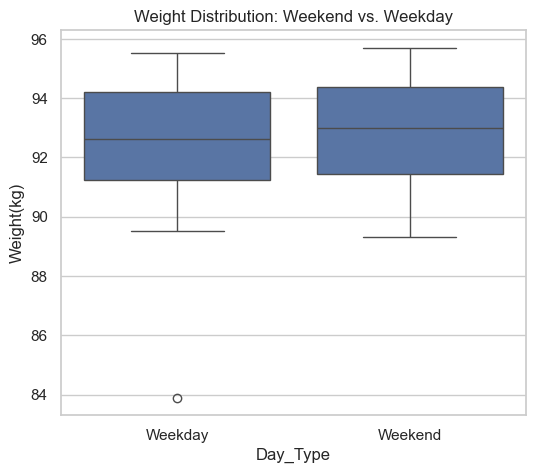

# Personal Health Data Analysis Report

## Introduction
This project explores personal health metrics, focusing on daily weight, step counts, gym attendance, and calorie intake. The objective is to uncover insights and correlations between these variables to better understand their impact on health and fitness progress over time.

---

## Project Goals
The primary goals of this analysis include:
- +Identifying correlations between calorie intake and weight changes.
- +Examining the relationship between step counts and weight management.
- +Analyzing the combined impact of calorie intake and physical activity.
- +Investigating temporal patterns and long-term trends in health metrics.

---

## Data Collection
**Data Sources:**
- **Weight:** - Measured daily using a digital scale (kg).
- **Step Count:** - Extracted from the Apple Health app.
- **Gym Attendance:** - Manually labeled as Yes or No.
- **Calorie Intake:** - Logged using MyFitnessPal.

---

## Data Processing
The data underwent preprocessing steps to ensure accuracy and consistency:
- **Data Cleaning:** Missing values were imputed or removed.
- **Feature Engineering:** Rolling averages and weight fluctuations were calculated.
- **Time-Series Alignment:** Consistent chronological ordering was ensured.

---

## Exploratory Data Analysis (EDA)

### Calorie Intake vs. Weight Changes
**Research Aim: How does daily calorie intake correlate with fluctuations in body weight?**

**Hypothesis:** 
Null Hypothesis (H0): No significant correlation between daily calorie intake and weight.
Alternative Hypothesis (H1): A significant correlation exists. 

**Observation:** 
- The correlation (Weight vs. Calories) is around 0.25. This indicates a mild positive correlation. If the p-value is above 0.05, it is not statistically significant.

- The correlation with previous-day calories is 0.32, that might be a stronger relationship. This suggests that day-lagged calories might align better with weight changes.
- A mild or moderate correlation (0.20–0.40) indicates a positive trend, but not extremely strong. I would need to confirm significance with a formal test if desired.

Pearson correlation (Today Weight vs. Previous-Day Calories): 0.323

### Physical Activity & Weight Management

**Research Aim: Does increased physical activity (steps, gym visits) contribute to weight loss or maintenance?**

**Hypothesis:** 
Null (H0): Weight is the same regardless of step count or gym attendance.
Alternative (H1): Weight differs on high vs. low step days or gym vs. no-gym days.

- **Observation:** 
- Gym vs. No-Gym:
- T-stat: -0.624, p-value: 0.537

Correlation (Steps vs. Weight): -0.091

High-Step vs. Low-Step:
  T-stat: -0.087, p-value: 0.932

- **Interpretation:**
- Gym vs. No-Gym:
p-value > 0.05, we cannot reject H0. This means the difference in average weight on gym vs. no-gym days is not statistically significant. Perhaps gym attendance did not drastically shift weight in this timeframe.

- Correlation (Steps vs. Weight):
A negative correlation around -0.09 suggests a weak negative relationship. p > 0.05, again it’s not significant.

- High-Step vs. Low-Step:
T-stat is very small (p >> 0.05), no significant difference in weight. This implies that, within the observed data, simply having more steps does not guarantee a significantly lower (or different) weight.

### Interplay Between Calorie Intake & Physical Activity

**Research Aim: How do calorie intake and step count interact to influence weight?**

**Hypothesis:** 
Null (H0): Weight is not better explained by combining both variables than by either alone.
Alternative (H1): A multiple regression (Calorie + Step_count) is a better model.

- **Observation:** 
- OLS Regression Results                            
==============================================================================
Dep. Variable:             Weight(kg)   R-squared:                       0.079
Model:                            OLS   Adj. R-squared:                  0.033
Method:                 Least Squares   F-statistic:                     1.717
Date:                Fri, 10 Jan 2025   Prob (F-statistic):              0.193
Time:                        11:51:13   Log-Likelihood:                -92.562
No. Observations:                  43   AIC:                             191.1
Df Residuals:                      40   BIC:                             196.4
Df Model:                           2                                         
Covariance Type:            nonrobust                                         
=================================================================================
                    coef    std err          t      P>|t|      [0.025      0.975]
---------------------------------------------------------------------------------

- **Interpretation:**
- Detailed Interpretation:
R-squared: It’s around 0.08, that’s only ~8% of weight variance explained by these two factors. This is low—suggesting we need more features (sleep, hydration, etc.) to predict weight.
Coefficients:
Calorie(kcal) has a p-value ~ 0.09, it’s not significant (p > 0.05), meaning no strong evidence that calories alone strongly predict weight within this dataset.
Step_count is also p > 0.05, it suggests no significant partial effect when controlling for calories. Possibly an extremely mild effect.
Conclusion: The model may not strongly explain weight changes. Real-world weight fluctuation can be more complex.

### Temporal Patterns and Trends
**Research Aim: Are there weekday/weekend differences?**
**Hypothesis:** 
Null (H0): No difference in average weight between weekday and weekend.
Alternative (H1): A difference exists.

- **Observation:** Calorie intake is higher during weekends, while step counts are lower.

- **Interpretation:**
- p-value ~ 0.60, not significant. We cannot conclude that weekend weight differs from weekday weight in a statistically meaningful way.
- If p-value < 0.05, we might have result in a real difference. A T-stat < 1, with a large p-value, typically indicates negligible difference.
---

## Data Analysis and Findings

### Weight Changes Over Time
- **Trend:** Weight fluctuates within a range but generally stabilizes over longer periods.

### Gym Attendance
**Hypothesis:** Regular gym attendance correlates with weight stability.

- **Observation:** No direct correlation between gym days and significant weight change was found.

### Correlation Matrix
- **Positive Correlation:** Calorie intake and weight.
- **Negative Correlation:** Step counts and weight fluctuations.

---

## Findings and Insights
### Key Insights:
- **Calorie intake** has a moderate positive correlation with weight changes.
- **Step counts alone** do not significantly drive weight loss but help with stability.
- **Gym attendance** alone does not impact weight fluctuations significantly.
- **Balanced calorie intake and activity** show the most effective weight stability.

---

## Conclusion
This personal health data analysis provides valuable insights into how calorie intake, step counts, and gym attendance influence body weight. While individual variables showed moderate correlations, a balanced approach combining calorie control and activity seems most effective.

### Future Directions:
- **Extended Data Collection:** Longer periods for better generalization.
- **Advanced Modeling:** Implementing machine learning models for predictive analysis.
- **Additional Metrics:** Adding sleep, hydration, and stress data for a more holistic view.

---

**Thank you for exploring this project.** Feel free to contribute or provide feedback!
